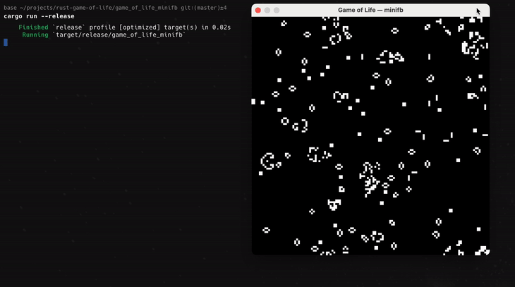

# Game of Life — Rust + minifb

A Conway’s Game of Life simulation written in Rust, using the [minifb](https://crates.io/crates/minifb) crate for
windowed rendering. This project showcases how to build a simple cellular automaton with live
controls (restart, speed up/down) in a native desktop window.



---

## Features

* Random initial state on startup and on restart
* Tick‑based evolution following Conway’s rules
* Real‑time controls

---

## Prerequisites

* **Rust toolchain** (with `cargo`): Install via [rustup.rs](https://rustup.rs)
* **Git** (optional, for cloning)
* Platform: Windows, macOS, or Linux

---

## Getting Started

### 1. Clone the repository

```bash
git clone https://github.com/josueggh/rust-game-of-life.git
cd rust-game-of-life
```

### 2. Install dependencies

The only external dependencies are in `Cargo.toml`:

* `minifb` for windolet width = 128;    // grid width
  let height = 128;    // grid height
  let scale = 4;      // pixel size of each cell
  let mut delay = 50;  // milliseconds between framesw management and pixel buffer
* `rand` for random initialization

Cargo will fetch these automatically.

### 3. Build & Run

In the project root:

```bash
cargo run --release
```

By default, the simulation runs at **128×128** cells with a **4×4** pixel scale and **50 ms** delay between ticks.
Adjust these settings in `src/main.rs` if desired.

---

## Configuration

In `src/main.rs`, you can modify:

```rust
let width = 128;    // grid width
let height = 128;    // grid height
let scale = 4;      // pixel size of each cell
let mut delay = 50;  // milliseconds between frames
```

Tweak these constants, then rebuild with `cargo run --release`.

---

## Controls

| Key     | Action                             |
|---------|------------------------------------|
| **R**   | Restart with a new random universe |
| **↑**   | Speed up (decrease delay by 5 ms)  |
| **↓**   | Slow down (increase delay by 5 ms) |
| **Esc** | Exit application                   |

---

## License

This project is licensed under the MIT License. See [LICENSE](LICENSE) for details.
